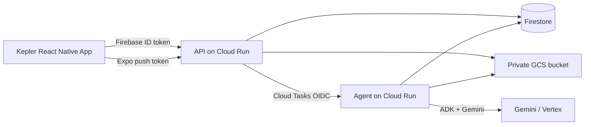

# Kepler

Kepler is an AI-powered construction management and Plan-vs-Reality platform. It helps contractors create and manage projects, collaborate with field teams, build project plans (manually or from uploaded construction documents), capture field measurements and evidence, compare reality against the baseline, surface deviations as deltas, and coordinate work through updates, comments, and notifications.

The product is delivered as an **Expo (SDK 54) React Native** mobile app backed by a **TypeScript Express API** and a separate **Field Variance / document-intelligence agent service**. Data is **local-first on device** (AsyncStorage) with **authorized cloud sync** to **Firestore** and private object storage.

> **Naming note:** The public product name is **Kepler**. Some internal package names, storage keys, API service identifiers, and file paths still use the earlier **BuildSigma** naming (for example `buildsigma_app`, `buildsigma-api`, `@buildsigma/...` AsyncStorage scopes). This README uses Kepler for product concepts and calls out legacy names only where they appear in the repo.

---

## Table of contents

1. [The problem](#1-the-problem)
2. [What Kepler does](#2-what-kepler-does)
3. [Core workflow](#3-core-workflow)
4. [Project creation](#4-project-creation)
5. [Project plans](#5-project-plans)
6. [Plan vs reality](#6-plan-vs-reality)
7. [Collaboration](#7-collaboration)
8. [AI / agent](#8-ai--agent)
9. [Google Cloud architecture](#9-google-cloud-architecture)
10. [Repository structure](#10-repository-structure)
11. [Local development](#11-local-development)
12. [Demo / recording flow](#12-demo--recording-flow)
13. [Testing](#13-testing)
14. [Security & privacy](#14-security--privacy)
15. [Known limitations](#15-known-limitations)

---

## 1. The problem

Construction teams often struggle with:

- Keeping the **project plan** aligned with what is actually happening in the field
- **Fragmented communication** between office, contractors, and field workers
- Tracking **changes**, **evidence**, and **review status** across many trades
- Understanding **quantity, cost, labor, and schedule impact** when reality diverges from plan
- Coordinating **members**, **assignments**, and **project activity** without losing context

Kepler connects planning, capture, comparison, and collaboration in one mobile-first workflow.

---

## 2. What Kepler does

The following capabilities are implemented in the current codebase (mobile + backend + agent). Features not listed here should be treated as out of scope or not yet built.

### Projects & planning

- **Project creation** with name, location, status, and optional project image (local storage; cloud bootstrap/sync supported)
- **Project hub** with plan, measurements, deltas, evidence, team, activity, intelligence, and related navigation
- **Manual plan items** — label, type (`length` | `area` | `count` | `volume`), planned quantity, unit, unit cost, production rate per day, labor hours per unit
- **Plan import from documents** — PDF/JPEG/PNG upload (up to 10 files, 25 MB each), cloud storage, AI extraction of **candidates**, human **review**, **selection/edit**, and **approval** into baseline `PlanItem` records with provenance

### Field capture & Plan-vs-Reality

- **Field measurements** against plan items (length-type flow is primary in capture UI)
- **Evidence** — photos and notes linked to measurements/deltas; signed upload to private storage
- **Deltas** — comparison of planned vs actual values with:
  - difference and percent difference
  - unit cost and **cost impact**
  - production rate and **schedule impact (days)**
  - labor hours per unit and **labor impact (hours)**
  - disposition status: `open` | `accepted` | `rejected` | `resolved`

### Work & progress

- **Work packages** and **work package assignments** (project-scoped)
- **Work progress** tracking and **contribution review** queues for shared/field contributions
- **Shared capture** path for invited field members on cloud projects

### Collaboration & activity

- **Project members** with roles: `owner`, `project_admin`, `contractor`, `field_member`, `viewer`
- **Invitations** and **shared/cloud project discovery**
- **Project-scoped chat** (conversations + messages)
- **Project activity** timeline (server-backed activity events)
- **Human project updates feed** (Home / Updates):
  - text posts with optional location label
  - image and video attachments (video shown with play-style presentation; not a full in-feed player)
  - **acknowledgements** and **comments**
  - author edit/delete (soft-delete) for own posts
- **In-app notifications** inbox with unread counts and deep links
- **Push notification delivery** via Expo push tokens (requires dev-client rebuild and EAS project configuration)
- **Authorized search** across projects, people (display names in accessible projects), and feed updates (substring matching; server-enforced scope)

### AI / agent (see dedicated section)

- **Plan document intelligence** — extract structured plan import candidates from uploaded files
- **Field Variance agent** — assess measurement/delta context, evidence relevance (including multimodal photo analysis), and structured recommendations with human-in-the-loop gates

---

## 3. Core workflow

Typical end-to-end flow (terminology matches app screens and domain types):

1. **Create a project** (name, location, status, optional image)
2. **Build the project plan**
   - Add plan items manually, **or**
   - **Generate from files** (plan import → AI candidates → review → approve)
3. **Review AI-generated suggestions** — select, edit, mark review state; only **approved** selections become baseline plan items
4. **Capture field reality** — measurements and photo/note evidence
5. **Compare plan vs reality** — deltas computed with quantity, cost, labor, and schedule fields
6. **Review and disposition deltas** — accept, reject, or resolve
7. **Track work** — work packages, assignments, and progress where configured
8. **Collaborate** — project updates, comments, acknowledgements, notifications, search, and team chat

---

## 4. Project creation

From **Projects**, users create a project with:

| Field | Supported |
| --- | --- |
| Project name | Yes |
| Location | Yes |
| Status | Yes (`active`, `planning`, `completed`, `on-hold`) |
| Project image | Yes (photo library; stored locally) |

Projects are stored **locally per owner** and can be **bootstrapped/synced** to the cloud API (`ensureRemoteProject` / bootstrap endpoints). Remote Firestore project IDs are server-generated and mapped from local IDs on the client.

---

## 5. Project plans

### Manual plan creation

From a project’s plan workflow, users can add items with:

- **Label**
- **Type** — length, area, count, volume
- **Planned quantity** and **unit**
- **Unit cost**
- **Production rate** (per day)
- **Labor hours per unit**

Manual items are created locally and sync to cloud plan-item bootstrap APIs.

### Agent-assisted plan generation (document import)

Supported path: **Plan → Add method → Generate from files** (`PlanImportStart`).

1. User selects **PDF or images** (and photos from library)
2. App creates a local `PlanImport`, uploads files via **signed PUT URLs** to private storage, then **commits** the import
3. Backend/agent pipeline marks import **processing** and runs **plan document intelligence** (Gemini via ADK)
4. Structured **`PlanImportCandidate`** records are stored (untrusted until human review)
5. User reviews in **Plan Import Review** — select/deselect, edit effective fields, review status
6. User confirms in **Plan Import Approval** — selected compatible candidates become **`PlanItem`** records with `origin: "plan_import"` and provenance links

**Human approval is required.** The agent does not write baseline plan items directly.

---

## 6. Plan vs reality

Kepler’s core value is connecting **baseline plan items** to **field measurements** and **evidence**, then surfacing **deltas** when reality diverges.

```
Project baseline (PlanItems)
        +
Field measurements + evidence
        ↓
   Delta records
        ↓
Review / disposition + impacts
```

For each delta, the backend model includes (among other fields):

| Computed / stored impact | Field |
| --- | --- |
| Quantity variance | `difference`, `percentDifference` |
| Cost impact | `costImpact` (from `unitCost`) |
| Schedule impact | `scheduleImpactDays` (from `productionRatePerDay`) |
| Labor impact | `laborImpactHours` (from `laborHoursPerUnit`) |

Deltas are linked to a **plan item** and **measurement** and carry an operational **status** for review workflows.

---

## 7. Collaboration

| Capability | Implementation notes |
| --- | --- |
| Project members & roles | Firestore `projectMembers`; server authorization on APIs |
| Invitations | `projectInvitations`; accept flows in app |
| Shared / cloud projects | Discovery + read paths for non-owner members |
| Work packages & assignments | Scoped work + member assignments |
| Project activity | `activityEvents` + Activity screens |
| Updates feed | `feedPosts`, acknowledgements, comments |
| Notifications | Per-user inbox; unread badge; deep links to posts/projects |
| Push | Expo device registration + backend delivery after notification create |
| Search | `GET /api/search?q=` — projects, people, updates in authorized scope only |
| Chat | Project-scoped conversations and messages |

**Feed video:** Posts can attach video; the feed UI shows a **play-style placeholder** over the attachment. Full in-feed video playback is limited/presentation-focused compared to images.

---

## 8. AI / agent

Kepler uses a **separate agent service** (`agent/`) in addition to the main API (`backend/`).

| Topic | Detail |
| --- | --- |
| Framework | [**Google Agent Development Kit (ADK)**](https://google.github.io/adk-docs/) — `@google/adk` (`LlmAgent`, `InMemoryRunner`, `FunctionTool`) |
| Model | Default **`gemini-3.5-flash`** via `GEMINI_MODEL` (Vertex / Gemini Enterprise configuration in agent env) |
| Invocation | Backend enqueues **Cloud Tasks** → agent HTTP (OIDC); local dev can run agent on port `8081` |

### What the agent actually does

**1. Plan document intelligence** (`processPlanImportExecution`)

- **Input:** Uploaded plan import files (bytes loaded from private storage), trusted file metadata
- **Output:** `PlanImportCandidate` suggestions (label, type, quantity, unit, confidence, source references)
- **Does not** create `PlanItem` records — candidates await human review/approval

**2. Field Variance workflow** (`startAgentRun` / `resumeAgentRun`)

- **Input:** Agent run scoped to project/delta/measurement; read-only tools load plan, measurement, delta, evidence metadata; optional **multimodal evidence photo** analysis (A6)
- **Output:** Structured **Field Variance assessment** (severity, recommended actions, documentation gaps) and optional **agent summaries**
- **Human gates:** Application policy (`assessmentPolicyGate`, evidence request flows) overrides model recommendations where required; evidence requests and escalations are **server-controlled**
- **Retries:** Attempt counting and idempotent resume; duplicate resumes avoid repeat Gemini calls where implemented

The agent is **not fully autonomous**. It produces structured analysis and suggestions; **humans approve plan baseline changes** and **own delta disposition**.

---

## 9. Google Cloud architecture

Verified from repo configuration and service code:

| Service | Role |
| --- | --- |
| **Cloud Run** | Hosts `buildsigma-api` (backend) and `buildsigma-agent` (agent service) |
| **Firestore** | Primary datastore (projects, plan items, measurements, deltas, evidence metadata, feed, notifications, agent runs, etc.) |
| **Cloud Storage** | Private bucket (`EVIDENCE_STORAGE_BUCKET`) for evidence bytes and plan-import objects |
| **Cloud Tasks** | Async enqueue of agent work from API |
| **Firebase Auth** | Mobile identity; ID tokens on `/api/*` |
| **Gemini (via ADK / Vertex)** | Plan extraction and field-variance reasoning |
| **Expo Push API** | Mobile push delivery (`exp.host`) |



**Not used for search:** Algolia, Elasticsearch, or other third-party search vendors (authorized Firestore-scoped substring search only).

---

## 10. Repository structure

```
buildsigma_app/          # Expo mobile app (Kepler UI)
  src/
    screens/             # App screens (Home, Projects, Search, Plan Import, …)
    components/          # UI including Kepler branding
    navigation/          # React Navigation (tabs + root stack)
    services/            # API clients, sync, feed publish, push
    store/               # AsyncStorage-backed local domain
    hooks/
  assets/                # Images, fonts, branding
  app.json               # Expo config (SDK 54)

backend/                 # buildsigma-api — Express + Firestore
  src/routes/            # REST routers
  src/services/          # Domain services (feed, search, plan import, push, …)
  src/repositories/      # Firestore access
  src/scripts/           # Phase regression tests

agent/                   # buildsigma-agent — ADK + Gemini
  src/agent/             # LlmAgent definitions
  src/services/          # Run lifecycle, plan import processing, evidence analysis
  src/scripts/           # Agent phase tests
```

---

## 11. Local development

### Prerequisites

- **Node.js 20+**
- **npm**
- **Expo dev client** (project uses `expo-dev-client`, not Expo Go alone for native modules like notifications)
- **Firebase** project (Auth + Firestore) and **GCP** credentials for backend/agent (Application Default Credentials locally)
- iOS Simulator or physical device for realistic file upload / push testing

### Mobile app

```bash
npm install
cp .env.example .env
# Set EXPO_PUBLIC_API_URL, EXPO_PUBLIC_FIREBASE_* (see .env.example — no secrets in repo)
npx expo start --dev-client --lan
```

Expo SDK: **54** (`expo ~54.0.36`). See [Expo v54 docs](https://docs.expo.dev/versions/v54.0.0/) before changing mobile dependencies.

### Backend API

```bash
cd backend
npm install
cp .env.example .env
# PORT, GOOGLE_CLOUD_PROJECT, EVIDENCE_STORAGE_BUCKET, Cloud Tasks / agent URLs as needed
npm run dev
```

Health check: `GET /health` (public). All `/api/*` routes require `Authorization: Bearer <Firebase ID token>`.

See `backend/README.md` for identity/bootstrap conventions and script reference.

### Agent service

```bash
cd agent
npm install
cp .env.example .env
# GEMINI_MODEL, GOOGLE_CLOUD_PROJECT, EVIDENCE_STORAGE_BUCKET, AGENT_SERVICE_URL, OIDC settings
npm run dev
```

Default agent port: **8081** (API default: **8080**).

### Typecheck

```bash
npx tsc --noEmit          # mobile (repo root)
cd backend && npm run typecheck
cd agent && npm run typecheck
```

---

## 12. Demo / recording flow

Suggested demo path on a physical device or simulator:

1. Sign in → **Home (Updates)** — Project Pulse, composer, feed
2. **Projects** → create or open a project
3. **Plan** → add manual items **or** **Generate from files** → review → approve import
4. **Capture** / project measurement flow → record field length
5. Open **Deltas** → review variance and impacts
6. Post a **project update** (photo/video) → acknowledge / comment
7. **Notifications** and **Search** (from Home search entry)
8. Optional: **Kepler showcase** — long-press the **Kepler logo** on the Home header to open full-screen `KeplerShowcase` (brand animation recording surface; hidden entry point)

---

## 13. Testing

The repo uses **phase scripts** (tsx) rather than a single unified test runner.

Examples:

| Area | Script |
| --- | --- |
| Feed / notifications / push / search | `backend/src/scripts/phaseFeed2AProjectFeedTest.ts` … `phaseFeed2FSearchTest.ts` |
| Plan import | `backend/src/scripts/phase2P2PlanImportUploadTest.ts` … `phase2P6PlanItemProvenanceTest.ts` |
| Agent | `agent/src/scripts/phaseAgentA3Test.ts` … `phaseAgentA7Test.ts` |

Run with `npx tsx <script>` from the appropriate package directory. Many scripts expect Firestore/Auth test configuration documented in `backend/README.md`.

---

## 14. Security & privacy

- **Authentication:** Firebase ID tokens on all `/api/*` routes; invalid/missing token → `401`
- **Authorization:** Server-enforced project membership and ownership; foreign resources return `404` (no enumeration)
- **Media:** Private GCS objects; time-limited signed URLs for upload/read; search results do not expose storage keys or signed URLs
- **Agent:** OIDC verification for Cloud Tasks → agent; tools use **trusted server-injected context** (not model-supplied IDs)
- **Secrets:** Never commit API keys, service account JSON, or passwords. Use `.env` locally and Cloud Run/Secret configuration in deployment

---

## 15. Known limitations

- **Legacy naming:** BuildSigma identifiers remain in packages, storage keys, and some UI strings (e.g. Expo app name in `app.json`).
- **Local-first sync:** Many domains write locally first; cloud sync is best-effort/retry-based for some entities.
- **Push notifications:** Require native rebuild, valid **EAS project ID** (`EXPO_PUBLIC_EAS_PROJECT_ID` or `extra.eas.projectId`); physical push may not be verified in all environments.
- **Search:** Substring matching within authorized project scope only — not full-text search at scale.
- **Plan import AI:** Quality depends on document clarity; all suggestions require human review before baseline commit.
- **Field Variance agent:** Produces assessments and recommendations; operational changes follow app policy and user actions.
- **Feed video:** Attachment supported; in-feed experience is image-forward with video indicated by placeholder/play affordance.

---

## License

Private / hackathon project. See repository owners for distribution terms.
